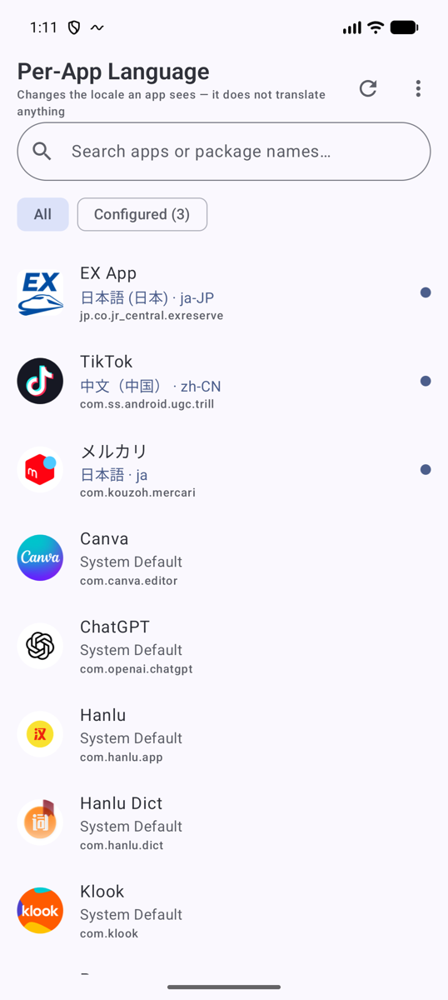
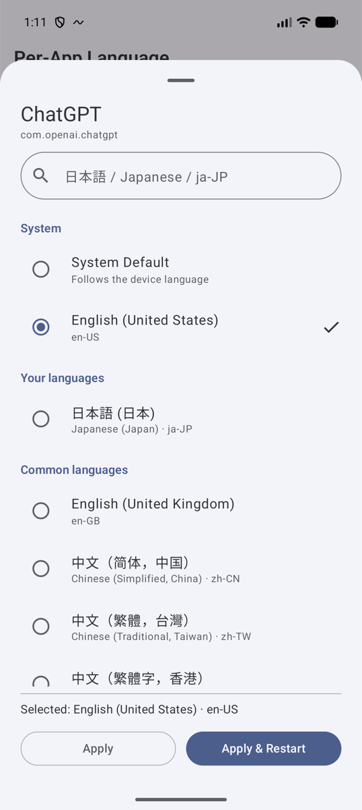
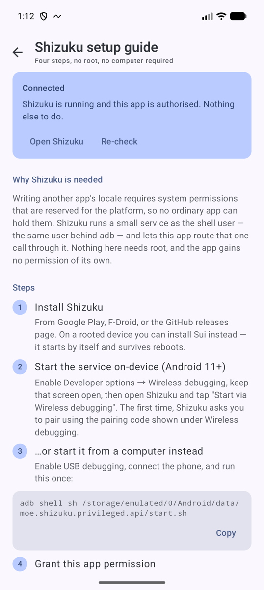
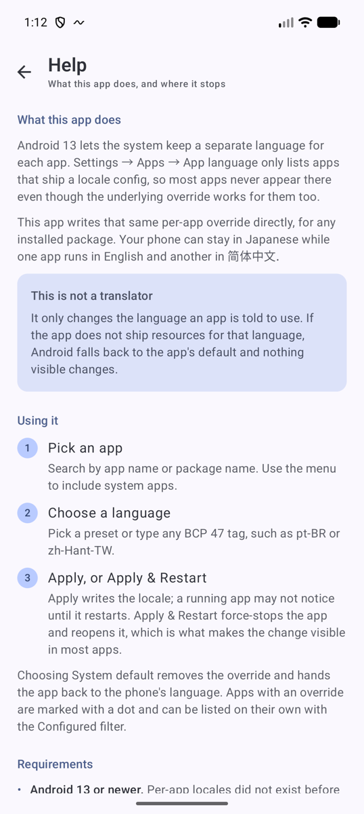

# Per-App Language

[English](README.md) | [简体中文](README.zh-CN.md) | [日本語](README.ja.md) | [한국어](README.ko.md) | Español | [Français](README.fr.md)

Una utilidad para Android que fuerza una **configuración regional** concreta en cada aplicación, incluso si la app no tiene un ajuste de idioma y no aparece en *Ajustes → Aplicaciones → Idioma de la aplicación*.

El teléfono puede seguir en español mientras WeChat y Taobao usan 简体中文, ChatGPT usa inglés y Google Maps se mantiene en español.

> **No es un traductor.**
> Cambia la configuración regional que la app *ve*. Si la app no incluye recursos para ese idioma, nada visible cambiará. Consulta [Lo que no puede hacer](#lo-que-no-puede-hacer).

---

## Capturas de pantalla

<table>
  <tr>
    <td align="center" width="25%"><br><sub><b>Todas las apps instaladas</b><br>Las apps modificadas se marcan y pueden colocarse al principio</sub></td>
    <td align="center" width="25%"><br><sub><b>Elige un idioma</b><br>Opciones, tus idiomas o cualquier etiqueta BCP 47</sub></td>
    <td align="center" width="25%"><br><sub><b>Configura Shizuku</b><br>Cuatro pasos, sin root ni ordenador</sub></td>
    <td align="center" width="25%"><br><sub><b>Ayuda</b><br>Qué hace y cuáles son sus límites</sub></td>
  </tr>
</table>

---

## Qué hace realmente

Android 13 introdujo las **configuraciones regionales por app**. El sistema guarda una sustitución `LocaleList` para cada paquete y la aplica a la `Configuration` de la app cuando esta se inicia. La app no tiene que adoptar la función: el framework sustituye su configuración de todos modos.

Lo único que la app debe admitir es *aparecer en la lista*: *Ajustes → Aplicaciones → Idioma de la aplicación* solo muestra apps que incluyen `locales_config.xml` (`android:localeConfig`). Las demás no aparecen en Ajustes, aunque la sustitución interna funciona igualmente.

Esta app escribe directamente esa misma sustitución para cualquier paquete instalado.

---

## Requisitos

| | |
|---|---|
| Android | 13 (API 33) o posterior |
| Root | no es necesario |
| [Shizuku](https://shizuku.rikka.app/) | necesario (o Sui en dispositivos rooteados) |

### Por qué Android 13+

Las configuraciones regionales por app son una función de plataforma añadida en Android 13. `LocaleManager`, el servicio del sistema `"locale"` y el almacén `LocaleList` por paquete no existen antes de API 33, ni hay un mecanismo equivalente para Android 12 o versiones anteriores.

### Por qué Shizuku

La API pública `LocaleManager.setApplicationLocales(LocaleList)` solo modifica la configuración regional del **paquete que la invoca**. El servicio interno expone una variante que recibe un paquete:

```aidl
// frameworks/base/core/java/android/app/ILocaleManager.aidl
void setApplicationLocales(String packageName, int userId, in LocaleList locales);                          // API 33
void setApplicationLocales(String packageName, int userId, in LocaleList locales, boolean fromDelegate);    // API 34+
LocaleList getApplicationLocales(String packageName, int userId);
```

`LocaleManagerService` permite esas llamadas si el proceso posee el paquete de destino o tiene:

* `android.permission.CHANGE_CONFIGURATION` — escribir una configuración regional
* `android.permission.READ_APP_SPECIFIC_LOCALES` — leerla
* `android.permission.FORCE_STOP_PACKAGES` — para *Aplicar y reiniciar*

Los tres permisos son `signature|privileged`, por lo que nunca se conceden a una app normal. Sin embargo, `com.android.shell` (uid 2000) declara los tres; por eso funciona `adb shell cmd locale set-app-locales …`.

Shizuku ejecuta un pequeño servicio con ese mismo uid shell y permite que una app encamine transacciones Binder a través de él. Esta app no obtiene ningún permiso: pide al uid shell que haga la llamada en su nombre. Por la misma razón, no necesita root.

### Por qué se necesita visibilidad completa de las apps

La función principal permite elegir **cualquier app instalada**, cuyos nombres de paquete no pueden conocerse de antemano. Las consultas limitadas de Android no pueden crear esa lista, por lo que la app declara `QUERY_ALL_PACKAGES`. Los paquetes, nombres, iconos, configuraciones regionales e idiomas declarados se usan solo en el dispositivo; la app no tiene permiso de Internet ni comparte el inventario. Consulta la [Política de privacidad](PRIVACY_POLICY.md).

---

## Descarga

Descarga el APK firmado desde la [última versión](https://github.com/TakeruF/android-perapp-language-selector/releases/latest). Todas las versiones se firman con la misma clave y la huella del certificado se publica en las notas de la versión.

Consulta los detalles en la [Política de privacidad](PRIVACY_POLICY.md).

---

## Configuración

1. **Instala Shizuku** desde [Google Play](https://play.google.com/store/apps/details?id=moe.shizuku.privileged.api), F-Droid o [GitHub Releases](https://github.com/RikkaApps/Shizuku/releases).

2. **Inicia el servicio Shizuku.**

   *En el dispositivo (Android 11+, sin ordenador):* Opciones para desarrolladores → activa **Depuración inalámbrica** → abre Shizuku → **Iniciar mediante depuración inalámbrica**.

   *Desde un ordenador:*
   ```
   adb shell sh /storage/emulated/0/Android/data/moe.shizuku.privileged.api/start.sh
   ```

   Shizuku se detiene al reiniciar y este paso debe repetirse. En dispositivos rooteados se puede usar **Sui**, que se inicia automáticamente.

3. **Abre Per-App Language** y acepta la solicitud de permiso de Shizuku.

4. Toca una app, elige un idioma y pulsa **Aplicar y reiniciar**.

> **Después de configurarlo:** Android conserva el idioma aplicado aunque Shizuku se detenga, el dispositivo se reinicie o se desactiven las Opciones para desarrolladores. Estas opciones y la depuración solo son necesarias para iniciar y mantener disponible Shizuku; actívalas y vuelve a iniciar Shizuku cuando quieras cambiar o restablecer un idioma. En dispositivos sin root hay que hacerlo después de cada reinicio. Si quieres mantener Shizuku disponible continuamente, su [guía de solución de problemas](https://shizuku.rikka.app/guide/setup/#start-via-wireless-debugging-start-by-connecting-to-a-computer-shizuku-randomly-stops) recomienda dejar activadas las Opciones para desarrolladores y la depuración USB.

---

## Cómo se aplica un cambio

```
Per-App Language (uid 10xxx)
        │  ServiceManager.getService("locale")      ← Binder directo, aún sin permiso
        ▼
  ShizukuBinderWrapper                              ← reencamina el Parcel
        │
        ▼
Proceso servidor de Shizuku (uid 2000 = com.android.shell)
        │  posee CHANGE_CONFIGURATION / READ_APP_SPECIFIC_LOCALES / FORCE_STOP_PACKAGES
        ▼
LocaleManagerService  →  sustitución LocaleList por paquete  →  se aplica al iniciar la app
```

La app implementa dos formas de comunicarse con el servicio y cambia automáticamente a la alternativa:

1. **Reflexión sobre `ILocaleManager$Stub.asInterface`** (principal). Inspecciona el método disponible para adaptarse al cambio de firma de API 33 a 34 (`fromDelegate`) y a modificaciones de fabricantes.
2. **Transacciones `Parcel` escritas a mano** (alternativa), usadas si la reflexión de API ocultas está bloqueada. No necesitan clases ocultas, a cambio de fijar los identificadores de transacción cuyo orden AIDL se mantiene desde API 33.

**Aplicar** solo escribe la configuración regional. **Aplicar y reiniciar** también llama a `IActivityManager.forceStopPackage()` y vuelve a abrir la app, porque muchas apps guardan sus textos al iniciar e ignoran cambios de configuración mientras están abiertas.

Elegir **Predeterminado del sistema** envía un `LocaleList` vacío, la forma del framework de eliminar la sustitución.

---

## Lo que no puede hacer

* **No puede traducir.** Configurar `zh-CN` en una app que solo incluye inglés no cambia nada; Android vuelve a los recursos predeterminados.
* **Las apps que eligen internamente su idioma** pueden ignorar la configuración regional del sistema. Ocurre si el idioma se guarda en la cuenta, el servidor o un ajuste interno, como en algunas superapps chinas.
* **Las apps que solo vuelven a leer la configuración al iniciar** necesitan *Aplicar y reiniciar*.
* **El contenido web dentro de una app** (WebView o pantallas generadas por servidor) suele seguir la cuenta o `Accept-Language`.
* Algunos sistemas de fabricantes pueden rechazar la **detención forzada**. La configuración se escribe igualmente; basta con cerrar la app. La interfaz lo indica.
* **Perfiles de trabajo y usuarios secundarios:** la app actúa sobre el usuario donde está instalada.
* Algunas ROM muy modificadas pueden limitar más los permisos shell que AOSP. La app muestra la `SecurityException` en lugar de fallar en silencio.

---

## Compatibilidad

Todo pasa por interfaces AOSP estándar: los servicios `"locale"` y `"activity"`, `PackageManager` y Shizuku. No hay lógica específica por fabricante ni una lista de modelos, por lo que funciona del mismo modo en AOSP, Pixel, One UI, ColorOS, OriginOS y HyperOS. Si un fabricante limita algo —normalmente la detención forzada— la app muestra el error en vez de aplicar soluciones específicas del dispositivo.

---

## Verificación

La capa privilegiada se ha comprobado sin mocks. `app/src/debug/.../LocaleGatewayProbe.kt` ejecuta las clases reales `LocaleGateway` y `ProcessGateway` como uid 2000 mediante `app_process`, directamente contra `LocaleManagerService` y sin Shizuku:

```
./gradlew assembleDebug
adb push app/build/outputs/apk/debug/app-debug.apk /data/local/tmp/probe.apk
adb shell CLASSPATH=/data/local/tmp/probe.apk app_process /system/bin \
    --nice-name=locale-probe dev.takeru.perapplocale.probe.LocaleGatewayProbe com.android.settings
```

Ejecuta tanto la ruta de reflexión como la de transacciones directas y compara cada resultado con `cmd locale get-app-locales`. Las nueve pruebas pasan en un emulador API 37, lo que confirma los identificadores de transacción, el formato de Parcel y el argumento `fromDelegate`.

También se verificó de extremo a extremo en ese emulador con Shizuku 13.6.0 real: cambios de estado (no instalado → permiso necesario → listo), diálogo de permisos, aplicación de `zh-CN` a una app de terceros, detención y reapertura, y restablecimiento al valor del sistema. Cada resultado se confirmó con `cmd locale get-app-locales`, no confiando solo en la interfaz.

Una salvedad: la única versión de Android disponible fue API 37. La rama de tres argumentos de `setApplicationLocales` para API 33 se deriva del código AOSP, pero no se ejecutó; sí se ejecutó la rama de cuatro argumentos para API 34+.

El procedimiento fijo entre fabricantes y el estado actual de las pruebas en Pixel/AOSP, One UI,
ColorOS e HyperOS se registran en [`docs/OEM_SMOKE_TEST.md`](docs/OEM_SMOKE_TEST.md).

---

## Arquitectura

```
app/src/main/java/dev/takeru/perapplocale/
├── PerAppLocaleApp.kt          Application; elimina límites de API ocultas, posee ShizukuRepository
├── MainActivity.kt             Actividad única, host Compose y conexión de eventos
├── core/
│   ├── SystemBinder.kt         Búsqueda de servicios + ShizukuBinderWrapper
│   ├── LocaleGateway.kt        get/setApplicationLocales — reflexión + transacciones directas
│   └── ProcessGateway.kt       forceStopPackage mediante IActivityManager
├── shizuku/
│   ├── ShizukuState.kt         READY / PERMISSION_REQUIRED / NOT_RUNNING / NOT_INSTALLED
│   └── ShizukuRepository.kt    Binder y listeners de permisos como StateFlow
├── data/
│   ├── AppInfo.kt              Una fila de la lista
│   ├── AppRepository.kt        Consultas a PackageManager
│   ├── LocaleOption.kt         Opciones + validación BCP 47
│   └── SettingsStore.kt        DataStore: preferencias y copia local de asignaciones
├── ui/                         Pantallas Compose (Material 3) y MainViewModel
│   └── theme/Theme.kt          Color dinámico y temas claro/oscuro
└── util/AppIcon.kt             Iconos con carga diferida y caché LRU
```

`MainViewModel` combina el estado de Shizuku, la lista de paquetes y las preferencias DataStore en un `MainUiState`. La interfaz es una función pura de ese estado; los eventos únicos, como los avisos o abrir una app, viajan por otro canal.

El sistema es la fuente de verdad de las configuraciones regionales. DataStore solo conserva una copia para mostrar inmediatamente las apps configuradas antes de que termine la lectura Binder.

---

## Compilación

```
git clone https://github.com/TakeruF/android-perapp-language-selector.git
cd android-perapp-language-selector
./gradlew assembleDebug
```

Requiere JDK 17 y Android SDK 36. Android Studio debería importar el proyecto directamente.

### Compilaciones de lanzamiento

`assembleRelease` firma el APK si existe `keystore.properties` en la raíz del proyecto. Sin ese archivo, la compilación también termina correctamente y genera un APK sin firmar.

```properties
storeFile=/absolute/path/to/release.jks
storePassword=…
keyAlias=…
keyPassword=…
```

El archivo y el almacén de claves están excluidos de Git.

---

## Agradecimientos

* **[VegaBobo/Language-Selector](https://github.com/VegaBobo/Language-Selector)** — trabajo previo que demostró que el control de configuraciones regionales por app mediante Shizuku es viable. Se consultó como referencia general; este proyecto es una implementación independiente basada en el código AOSP y la API de Shizuku y no incluye su código. Si en el futuro se incorpora código, se añadirá formalmente su atribución Apache-2.0.
* **[RikkaApps/Shizuku](https://github.com/RikkaApps/Shizuku)** y la API de Shizuku.
* **[LSPosed/AndroidHiddenApiBypass](https://github.com/LSPosed/AndroidHiddenApiBypass)**.

## Licencia

Apache License 2.0 — consulta [LICENSE](LICENSE).
